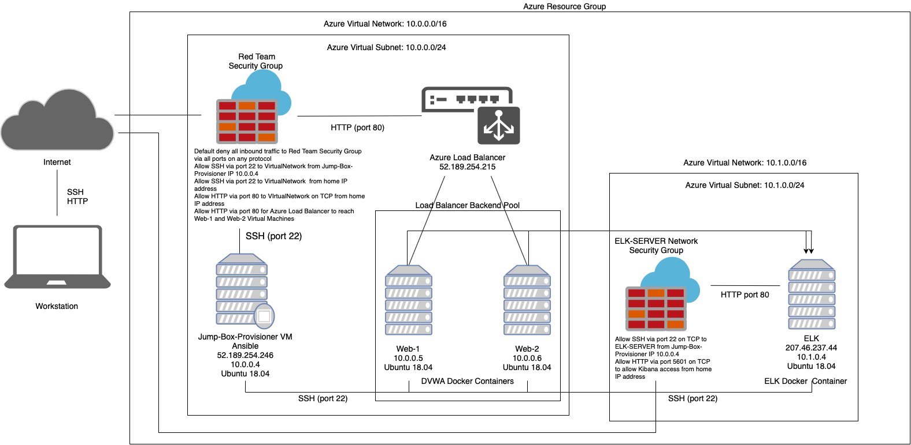
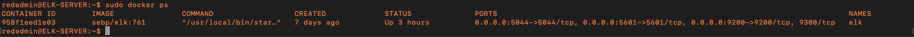

# elk-project

## Automated ELK Stack Deployment

The files in this repository were used to configure the network depicted below.

These files have been tested and used to generate a live ELK deployment on Azure. They can be used to either recreate the entire deployment pictured above. Alternatively, select portions of the *filebeat-playbook.yml* file may be used to install only certain pieces of it, such as Filebeat.

This document contains the following details:
- Description of the Topologu
- Access Policies
- ELK Configuration
  - Beats in Use
  - Machines Being Monitored
- How to Use the Ansible Build

### Description of the Topology

The main purpose of this network is to expose a load-balanced and monitored instance of DVWA, the D*mn Vulnerable Web Application.

Load balancing ensures that the application will be highly available, in addition to restricting access to the network.

Integrating an ELK server allows users to easily monitor the vulnerable VMs for changes to the file system and system metrics.

The configuration details of each machine may be found below.
_Note: Use the [Markdown Table Generator](http://www.tablesgenerator.com/markdown_tables) to add/remove values from the table_.

| Name                 | Function       | IP Address | Operating System |
|----------------------|----------------|------------|------------------|
| Jump-Box-Provisioner | Gateway        | 10.0.0.4   | Linux            |
| Web-1                | Web Server     | 10.0.0.5   | Linux            |
| Web-2                | Web Server     | 10.0.0.6   | Linux            |
| ELK                  | ELK Web Server | 10.1.0.4   | Linux            |

### Access Policies

The machines on the internal network are not exposed to the public Internet. 

Only the Jump-Box-Provisioner machine can accept connections from the Internet. Access to this machine is only allowed from the following IP addresses:
- 139.218.106.25

Machines within the network can only be accessed by Jump-Box-Provisioner Virtual Machine, IP 10.0.0.4.

A summary of the access policies in place can be found in the table below.

| Name                 | Publicly Accessible | Allowed IP Address |
|----------------------|---------------------|--------------------|
| Jump-Box-Provisioner | Yes                 | 139.218.106.25     |
| Web-1                | No                  | 10.0.0.4           |
| Web-2                | No                  | 10.0.0.4           |
| Elk                  | No                  | 10.0.0.4           |

### Elk Configuration

Ansible was used to automate configuration of the ELK machine. No configuration was performed manually, which is advantageous because it allows for simple and efficient deployment, configuration and management of the ELK stack across many servers.

The playbook implements the following tasks:
- Install docker
- Install python3-pip
- Install pip docker package
- Configures Elk Virtual Machine to use more memory to run the ELK container
- Download Docker container created by sebp, which is an elk container version 761
- Starts docker container on boot

The following screenshot displays the result of running `docker ps` after successfully configuring the ELK instance.

### Target Machines & Beats
This ELK server is configured to monitor the following machines:
- Web-1 10.0.0.5
- Web-2 10.0.0.6

We have installed the following Beat on these machines:
- Filebeat

This Beat allow us to collect the following information from each machine:
- Filebeat collects log files, for example pages viewed by users on the Apache server, and forwards this information to Elasticsearch for indexing, Logstash for processing or Kibana for visualising the data in charts and graphs. 

### Using the Playbook
In order to use the playbook, you will need to have an Ansible control node already configured. Assuming you have such a control node provisioned: 

SSH into the control node and follow the steps below:

- Copy the *filebeat-playbook.yml* file to */etc/ansible/roles/*.

- Update the *filebeat-config.yml* file to include your ELK machine's IP address in hosts under output.elasticsearch: 
        
        output.elasticsearch:
        hosts: ["Your-IP-Address:9200"]
        username: "elastic"
        password: "changeme"
    
    And scroll to setup.kibana and update to include your ELK machine's IP address:
        
        setup.kibana
        host: "Your-IP-Address:5601"
        
    Save *filebeat-config.yml* to */etc/ansible/files/*.
    
- Run the playbook, and navigate to http:[Elk-Public-IP]:5601/app/kibana#/home/tutorial/systemLogs and select *Check Data*

_As a **Bonus**, provide the specific commands the user will need to run to download the playbook, update the files, etc._

- Open terminal and SSH to Jump-Box-Provisioner
- 
